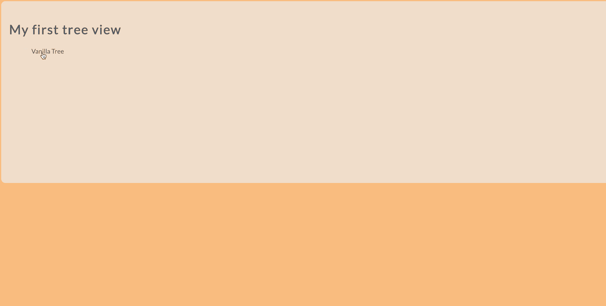

# Tree View

순수 자바스크립트와 HTML5, CSS3로 폴더/파일 구조를 웹으로 표현한 단순한 애플리케이션입니다.



## Setup

Install dependencies

```sh
$ yarn install (or npm install)
```

## Development

```sh
$ yarn dev (or npm run dev)
# visit http://localhost:8080
```

## Feature

1. 각 폴더에는 파일을 생성할 수 있는 버튼이 있습니다.
2. 파일을 더블 클릭할 경우, 폴더로 변경됩니다.
